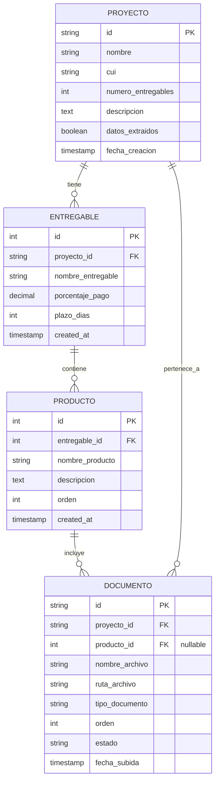
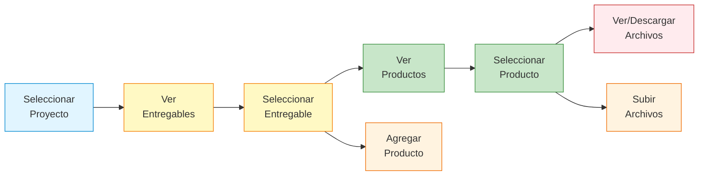
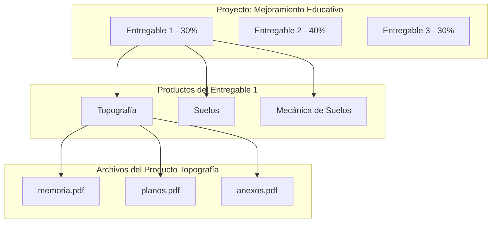

```mermaid
graph TD
    A[PROYECTO<br/>Mejoramiento del<br/>Servicio Educativo] --> B[ENTREGABLE 1<br/>Primer Entregable - 30%<br/>45 días]
    A --> C[ENTREGABLE 2<br/>Segundo Entregable - 40%<br/>60 días]
    A --> D[ENTREGABLE 3<br/>Entregable Final - 30%<br/>90 días]
    
    B --> E[PRODUCTO 1.1<br/>Informe Técnico de Topografía]
    B --> F[PRODUCTO 1.2<br/>Planos Topográficos]
    B --> G[PRODUCTO 1.3<br/>Estudio de Suelos]
    
    C --> H[PRODUCTO 2.1<br/>Memoria Descriptiva<br/>de Arquitectura]
    C --> I[PRODUCTO 2.2<br/>Planos de Arquitectura]
    C --> J[PRODUCTO 2.3<br/>Especificaciones Técnicas]
    
    D --> K[PRODUCTO 3.1<br/>Presupuesto Final]
    D --> L[PRODUCTO 3.2<br/>Cronograma de Obra]
    
    E --> E1[📄 memoria_descriptiva.pdf]
    E --> E2[📄 panel_fotografico.pdf]
    E --> E3[📄 anexos.pdf]
    
    F --> F1[📄 plano_ubicacion_A1.pdf]
    F --> F2[📄 plano_perimetrico_A1.pdf]
    
    G --> G1[📄 informe_ensayos.pdf]
    G --> G2[📄 resultados_laboratorio.xlsx]
    
    H --> H1[📄 memoria_arquitectura.pdf]
    
    I --> I1[📄 plantas_A1.pdf]
    I --> I2[📄 cortes_A1.pdf]
    I --> I3[📄 elevaciones_A1.pdf]
    
    J --> J1[📄 especificaciones.pdf]
    
    K --> K1[📄 presupuesto.xlsx]
    K --> K2[📄 analisis_precios.xlsx]
    
    L --> L1[📄 cronograma_gantt.pdf]
    
    style A fill:#e1f5ff,stroke:#0288d1,stroke-width:3px
    style B fill:#fff9c4,stroke:#f57c00,stroke-width:2px
    style C fill:#fff9c4,stroke:#f57c00,stroke-width:2px
    style D fill:#fff9c4,stroke:#f57c00,stroke-width:2px
    style E fill:#c8e6c9,stroke:#388e3c,stroke-width:2px
    style F fill:#c8e6c9,stroke:#388e3c,stroke-width:2px
    style G fill:#c8e6c9,stroke:#388e3c,stroke-width:2px
    style H fill:#c8e6c9,stroke:#388e3c,stroke-width:2px
    style I fill:#c8e6c9,stroke:#388e3c,stroke-width:2px
    style J fill:#c8e6c9,stroke:#388e3c,stroke-width:2px
    style K fill:#c8e6c9,stroke:#388e3c,stroke-width:2px
    style L fill:#c8e6c9,stroke:#388e3c,stroke-width:2px
```

## Leyenda

- 🔵 **PROYECTO** - Nivel superior del sistema
- 🟡 **ENTREGABLE** - Hitos del proyecto con % de pago y plazo
- 🟢 **PRODUCTO** - Componentes específicos de cada entregable
- 📄 **ARCHIVO** - Documentos físicos (PDF, XLSX, etc.)

## Relaciones de Base de Datos



## Flujo de Navegación en el Sistema



## Casos de Uso

### Caso 1: Proyecto con 3 Entregables



### Caso 2: Búsqueda Jerárquica

```mermaid
flowchart TD
    Q[Usuario busca:<br/>"plano de ubicación"] --> S1{Buscar en Archivos}
    S1 --> R1[📄 plano_ubicacion_A1.pdf]
    R1 --> P1[Pertenece a:<br/>Producto "Planos Topográficos"]
    P1 --> E1[Dentro de:<br/>Entregable "Primer Entregable"]
    E1 --> PR[Del proyecto:<br/>"Mejoramiento Educativo"]
    
    style Q fill:#fff3e0
    style R1 fill:#ffebee
    style P1 fill:#c8e6c9
    style E1 fill:#fff9c4
    style PR fill:#e1f5ff
```
